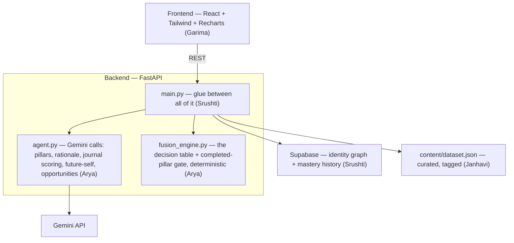

# Kairos
**Understand · Reason · Recommend · Redirect · Reflect · Discover**

Team VECTRA — built at the IIIT Pune 24-Hour Hackathon (HBTM x IABTM), for the
theme "Agentic AI for Human Potential."

## What it does

Most recommendation engines match you to content you already like. Kairos does
the opposite — it asks who you're *trying to become*, and recommends based on
the gap between that and where you actually are.

You type a "Future Self" statement — say, "a confident public speaker." Gemini
breaks that down into 4-5 concrete pillars (storytelling, voice control, stage
presence, handling Q&A), each starting at a low mastery score. From there,
every recommendation comes out of a simple decision table: how big is the gap,
and is there any urgency (a deadline you mentioned)? Based on that, you get a
deep resource, a quick primer, stretch content, or — if you've been drifting
toward passive scrolling — a redirect nudge instead. Gemini writes one line
explaining why it picked that thing for you, right now.

Journal a reflection and Gemini reads it, figures out which pillars it
touched, and moves your mastery scores live. That movement now gets saved
over time too, so there's an actual growth timeline instead of just a number
that overwrites itself. And if you want a nudge, you can open a short chat
with your own future self — grounded in your real pillar data, not a canned
response.

Once a pillar stops being a gap — mastery score high enough that you're
genuinely strong in it, not just improving — Kairos stops recommending
content for it and starts surfacing what you can *do* with it instead: real
programs, competitions, internships, meetups, and scholarships that fit what
you've actually built. Learning doesn't just loop back into more learning.

## Why it's different

- **Gap, not match.** We're not filtering by interest tags — we're tracking
  distance from an aspiration. That's closer to a coach than a search engine.
- **It explains itself.** Every pick comes with a reason, generated fresh each
  time, tied to your own words.
- **It pushes back against doomscrolling on purpose.** Drift detection isn't
  a side feature — it's a direct answer to "algorithms optimize for
  attention." We can demo the mechanism, not just talk about wanting one.
- **It closes the loop.** The future-self chat and the growth timeline turn
  "your gap is closing" from a claim into something you can actually see and
  talk to.
- **It doesn't stop at content.** AI Opportunity Discovery is the part almost
  no recommendation system does: once you've actually built mastery in
  something — say Fashion, Branding, and Instagram Marketing — instead of
  recommending you *another* course, Kairos tells you what you're now
  eligible for: a Brand Ambassador Program, a Fashion Internship, a Content
  Creator Competition, local Fashion Meetups, relevant scholarships. Instead
  of learning forever, the AI connects learning to opportunities.

Runs entirely on free tiers — Gemini via AI Studio, Supabase, Render, Vercel.
No card needed anywhere.

## Architecture



The logic (decision table, and which pillars count as "completed" enough to
act on) and the intelligence (Gemini calls) are kept in separate files on
purpose — one's deterministic, one's generative, and we didn't want them
tangled together. `main.py` is just the wiring.

## Team

| Part | Who | Stack |
|---|---|---|
| Frontend | Garima | React (Vite), Tailwind, Recharts |
| Backend core | Srushti | FastAPI, Supabase |
| Agent service | Arya | Google Gen AI SDK (Gemini) |
| Content dataset | Janhavi | Hand-curated JSON |

## Running it locally

```bash
# backend
cd backend
source venv/bin/activate
uvicorn app.main:app --reload --port 8000

# frontend (separate terminal)
cd frontend
npm run dev
```

You'll need `backend/.env` with `SUPABASE_URL`, `SUPABASE_KEY`, and
`GEMINI_API_KEY`, plus `frontend/.env.local` with `VITE_API_URL`. None of
these get committed — check `.gitignore`.

## Endpoints

`/api/onboard` · `/api/recommend` · `/api/journal` · `/api/twin-message` · `/api/timeline` · `/api/opportunities`

## Deployed

- Backend: `<Render URL>`
- Frontend: `<Vercel URL>`
